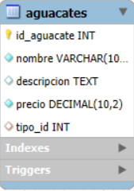
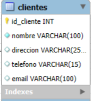
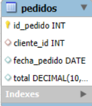

# Aguacates Store 🥑

Base de datos creada con fines de practicar el uso de triggers y eventos dentro de la simulacion de una tienda de aguacates.

## Tabla de contenido 📋

| Indice | Titulo          |
| ------ | --------------- |
| 1      | Intalacion      |
| 2      | Tecnologias     |
| 3      | Entidades Prin  |
| 4      | Triggers        |
| 5      | FAQs            |
| 6      | Licencia        |
| 7      | Contacto        |

## Instalacion

```bash
git clone https://github.com/Adrian-ortiz0/Aguacates_StoreSQLPractica
cd Aguacates_StoreSQLPractica
code .
```

## 2 Tecnologias 👩‍💻

Lista de tecnologías utilizadas en el proyecto:

- [MySQL](<[https://developer.mozilla.org/en-US/docs/Web/MYSQL](https://developer.mozilla.org/en-US/docs/Web/MYSQL)>): Utilizado para la gestión de la base de datos relacional.

## 3 Entidades Principales 🎞

1. Aguacates



2. Clientes



3. Pedidos



## Triggers

-- 1. Trigger para insertar un registro en un log cuando se inserta un nuevo tipo de aguacate.

CREATE TABLE log_tipos_aguacate (
    id_log INT PRIMARY KEY AUTO_INCREMENT,
    tipo_id INT,
    accion VARCHAR(50),
    fecha TIMESTAMP DEFAULT CURRENT_TIMESTAMP
);

DELIMITER //

create trigger insertar_si_nuevo_aguacate
after insert on Tipos_Aguacate
for each row
begin
	insert into log_tipos_aguacates (tipo_id, accion)
    values (NEW.id_tipo, "INSERT");
end ;
//
DELIMITER ;

-- 2. Trigger para actualizar el precio de un aguacate y registrar el cambio.

-- log para el segundo trigger

create table log_aguacate_precio(
    id_log int primary key auto_increment,
    aguacate_id int,
    precio_anterior decimal(10, 2),
    precio_nuevo decimal(10, 2),
    fecha_registro datetime default current_timestamp
);

DELIMITER //
create trigger actualizar_precio_aguacate
after update on Aguacates
for each row
begin
	insert into log_aguacate_precio (aguacate_id, precio_anterior, precio_nuevo)
    values (OLD.id_aguacate, OLD.precio, NEW.precio)
end ;
DELIMITER ;

-- 3. Trigger para establecer el subtotal automáticamente en la tabla Detalles_Pedido.

DELIMITER //
create trigger actualizar_subtotal
after insert on Detalles_Pedido
for each row
begin
	declare precio_aguacate decimal(10,2);
    
    select precio into precio_aguacate
    from aguacates
    where id_aguacate = NEW.id_aguacate;
    
    update Detalles_Pedido
    set subtotal = NEW.cantidad * precio_aguacate
    where id_detalle = NEW.id_detalle;
end;
//
DELIMITER ;

-- 4. Trigger para eliminar un registro de log cuando se borra un tipo de aguacate.
DELIMITER //

create trigger eliminar_registro
after delete on Tipos_Aguacate
for each row
begin
	delete from log_tipos_aguacate
    where tipo_id = OLD.id_tipo;
end;
//
DELIMITER ;

-- 5. Trigger para registrar cuando se crea un nuevo cliente.

create table log_clientes(
	id_log int primary key auto_increment,
    id_cliente int,
    nombre_cliente varchar(100),
    fecha_registro timestamp default current_timestamp
);

DELIMITER //

create trigger registrar_nuevo_cliente
after insert on Clientes
for each row
begin
	insert into log_clientes(id_cliente, nombre_cliente)
    values (NEW.id_cliente, NEW.nombre);
end ;
//

DELIMITER ;

-- 6. Trigger para validar el correo del cliente antes de la inserción.

DELIMITER //

CREATE TRIGGER validar_correo
BEFORE INSERT ON Clientes
FOR EACH ROW
BEGIN
    -- Si el formato de correo es incorrecto, lanzar un error
    IF NOT NEW.email REGEXP '^[A-Za-z0-9._%+-]+@[A-Za-z0-9.-]+\.[A-Za-z]{2,}$' THEN
        SIGNAL SQLSTATE '45000'
        SET MESSAGE_TEXT = 'El formato de correo no es válido';
    END IF;
END;
//

DELIMITER ;

-- 7. Trigger para actualizar el total del pedido automáticamente cuando se insertan detalles.

DELIMITER //

create trigger actualizar_pedido
after insert on Detalles_Pedido
for each row
begin
	update Pedidos
    set total = (
		select sum(subtotal)
        from Detalles_Pedido
        where pedido_id = NEW.pedido_id
    )
    where id_pedido = NEW.pedido_id;
end ;
//
DELIMITER ;

-- 8. Trigger para eliminar detalles de pedido asociados cuando se borra un pedido.

DELIMITER //

create trigger eliminar_detalles_cuando_se_borra_un_pedido
after delete on Pedidos
for each row
begin
	delete from Detalles_Pedido
    where Detalles_Pedido.pedido_id = OLD.Pedidos.id_pedido;
end ;
//
DELIMITER ;

-- 9. Trigger para registrar un log al eliminar un cliente.

create table log_clientes_eliminados(
	id_log int primary key auto_increment,
    id_cliente int,
    nombre varchar(100),
	fecha_eliminacion timestamp default current_timestamp
);

DELIMITER //

create trigger registro_clientes_eliminados
after delete on Clientes
for each row
begin
	insert into log_clientes_eliminados(id_cliente, nombre)
    values (OLD.Clientes.id_cliente, OLD.Clientes.nombre);
end ;
//
DELIMITER ;

-- 10. Trigger para validar la cantidad de aguacates en el pedido.
DELIMITER //
create trigger validar_antes_pedido
before insert on Detalles_Pedido
for each row
begin
	if NEW.cantidad >= 1 then
    SIGNAL SQLSTATE '45000' SET MESSAGE_TEXT = 'La cantidad de aguacates debe ser al menos 1';
    end if;
end ;
//
DELIMITER ;

## 5 FAQs ❔

Lista de preguntas frecuentes:

1. ¿Cómo puedo contribuir al proyecto?
   _Puedes contribuir creando un fork del repositorio y enviando un pull request._

2. ¿Este proyecto está abierto a contribuciones?
   | Tipo de contribución | Aceptado | Comentarios |
   |:---------------------|:--------:|------------:|
   | Reporte de errores | Sí | Utiliza la sección de issues en GitHub |
   | Nuevas características| Sí | Envía un pull request con tus propuestas |

## 6 Licencia 🖍

Este proyecto está licenciado bajo la Licencia MIT.

> La Licencia MIT es una licencia de software libre permisiva que es ampliamente utilizada en la comunidad de software

## 7 Contacto 📱

Para realizar futuros aporter

dxniel7328@gmail.com